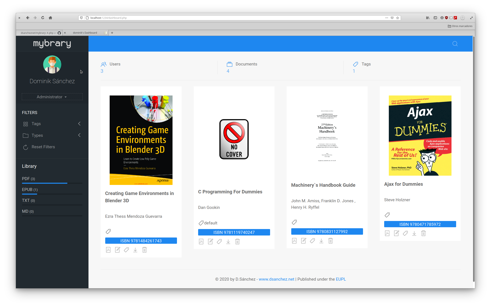

# mybrary

A library managing system for local area networks


## Motivation

The reason I started this project was because I wanted a php script that was able to classify and share my huge e-book collection with my family on my local network. I wanted all my family members to be able to access the books without the need to explicitly grant them access to my data volume on my NAS ( kids can do a pretty big damage on important data, believe me ). On the other hand I needed a way to search efficiently through my collection and have my books readily available on any device. Presently I do have a big collection of books stored on a Calibre installation but I really don't like the interface Calibre has; also calibre's functionality is actually slightly different to the needs I have. So I sat down and wrote this...


## What mybrary is, and what not

mybrary is a document management system for **ONE** ( exactly one ) library, containing ∞ ( that's infinite ) books with access to ∞ ( that's infinite again ) users to read all ( that's all of them ) books. mybrary is **NOT** a full fledged document management system with various user levels and different read permissions. Maybe somebody wants to add this feature in the future... but I don't have a need for it right now. So let me say that again to clarify: userlevels in mybrary just exist to prevent certain users from **editing** metadata or **uploading** books to the library. There is **no possibility** to prevent a registered user from reading any of the book contained in the library - or to put it another way: you cannot hide certain books from certain users.


## Installation


### Creating the database

From terminal (this will be changed in the future) execute the following statement from the mybrary directory to create a new empty database:

```
  cat db/mybrary_scheme.sql | sqlite3 db/mybrary.db
```


### Starting to serve on a desktop computer

Once all databases have been created, use the following statement to run mybrary from inside it's directory:

```
  php -S 0.0.0.0:1234
```

This will start a PHP development server, serving on port 1234 ( this makes an unprivileged start possible ) to any IP on the local system. You may access the library from any other device on the local area network through the local ip of the computer.


### Starting to serve on a NAS

I personally run a Synology NAS with the nginx webserver and php version 7.4. Just copy the whole directory as is to a directory of your choice and start adding documents.


## Limitations

This php script intentionally does *not* require/use a mariadb database server on the host. It uses sqlite3 instead. This strategy has its advantages but algo some disadvantages. As the library is multi-user but mono-library ( i.e. all registered users can *read* - and some can *edit* and *upload* books ) the use of sqlite3 can slow down the execution of the script...but as the intended use is for family sharing of books or small community access, it should not pose a big problem. It would be easily possible though, to port the software to use mariadb or similar...but this is something that I have no need to do, so I leave this task to others.

Let me quote sqlite's website for those with doubts on performance:

> SQLite works great as the database engine for most low to medium traffic websites (which is to say, most websites). The amount of web traffic that SQLite can handle depends on how heavily the website uses its database. Generally speaking, any site that gets fewer than 100K hits/day should work fine with SQLite. The 100K hits/day figure is a conservative estimate, not a hard upper bound. SQLite has been demonstrated to work with 10 times that amount of traffic.

I guess, we can safely assume that no family has more than 100.000 per day on their library...

Every book, can only exist once. It is *not* possible to have different copies of the same book in different formats. Please choose the best format for your needs and convert it to other formats if needed ( use Calibre for that ).


### Further informations

When you first install mybrary, the library contains a book which is the user and administration manual of the software. You may want to keep it in a safe place to be able to have a look at it in case you hace any doubt about it's usage. Or just throw it away and check the manual from github repo, which is probably more up to date.


## Credits

mybrary is released under the EUPL and uses the following third parte libraries and grafx:

Avatars are made by [Freepik](https://www.flaticon.com/authors/freepik) from [www.flaticon.com](https://www.flaticon.com/)

PDF Reader component [PDF.js](https://mozilla.github.io/pdf.js/) © Mozilla Foundation, licensed unter Apache license.

ePUB Reader component [BiB/i](https://github.com/satorumurmur/bibi) is written by Satoru Matsushima and published under the MIT License.

Markdown parser component [Parsedown](https://parsedown.org/) and [Parsedown Extra](https://github.com/erusev/parsedown-extra) by Emanuil Rusev and Antonio Stoilkov under MIT License


### TODO

- [ ] Verbose error messages
